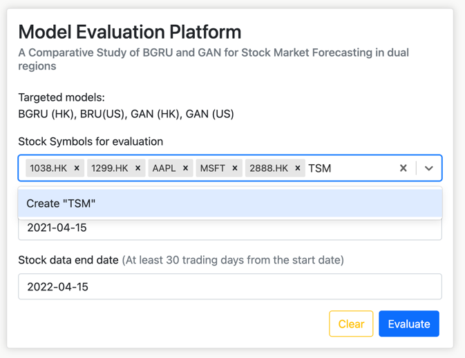
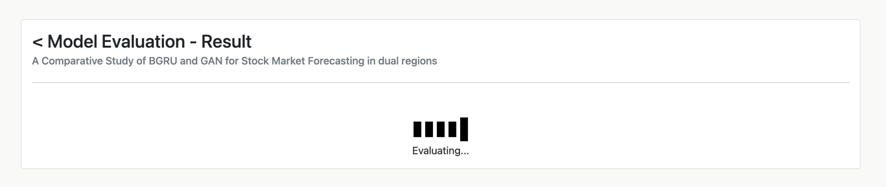

# Model evaluation platform - User Guide

## Select stocks for evaluation
1. Visit the <b>frontend</b> of the model evaluation platform. It's default on port 80.
2. Select Stocks Symbols from the dropdown-combo-box of field `Stock Symbol for evaluation`.

3. Or, you could type a Stock Symbol into the dropdown-combo box, and create `Create` options.

4. Next, Click on the `Stock data start date` field, and select a <b>start date</b> of the evaluation dataset. For example, 2020-04-01.

5. Then, Click on the `Stock data end date` field, and select an <b>end date</b> of the evaluation dataset. For example, 2021-04-01.

6. After all parameter is set. Click `Evaluate` button in the bottom right corner.

7. Stay on the page and wait for around 1.5 minutes. The evaluation results will be automatically shown.

8. The result page is shown.

## FAQ

### 1. Is there any documentation for the backend api?
<b>Ans:</b> Yes, its on the `http://{url}:8000/docs`

### 2. Why my evaluation results is different from yours?
<b>Ans:</b> The model is predominantly trained and evaluated on an Apple M1 Macbook with arm64 architecture. It is possible, but not a must, different CPU architectures might generate slightly different prediction results on the stock closing price.    

### 3. Why it takes a long time to evaluate the models?
<b>Ans:</b> If the server does not possess any data for the selected stocks, it will download the data from Yahoo Finance API, and do the data preprocessing, model prediction, and model evaluation in parallel. So, it might take some time during the evaluation progress.